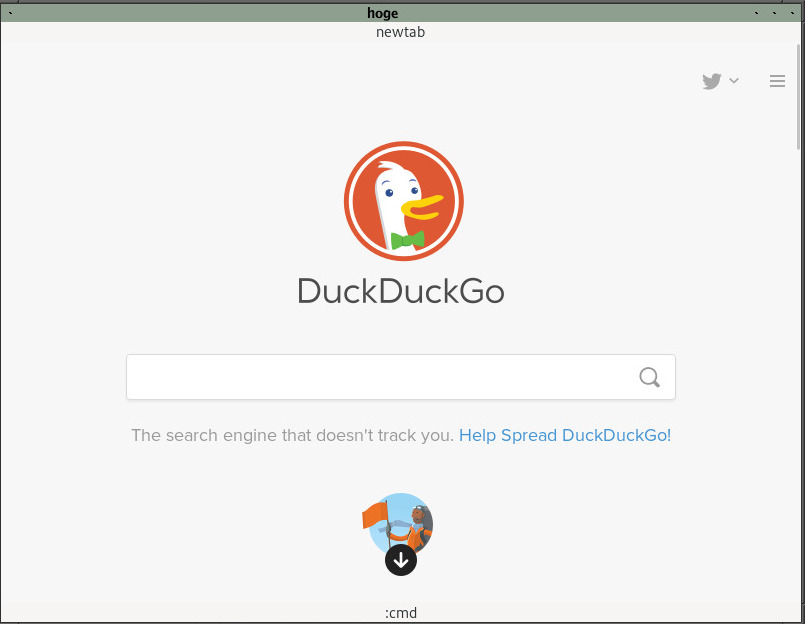

This program is keyboard-driven vim like browser. This is not for commercial purpose, but 
I am trying to make it similar to qutebrowser. For this program, I used webkitgtk+ and gtk+ library.

To use this program, open your terminal and type:

$ ./run

Command usage:

:q	: quit

